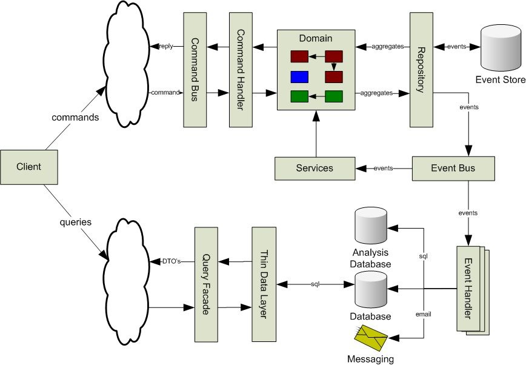

# Avant de commencer

Cette bibliothèque utilise des concepts et _Design Patterns_ qu’il est important de connaitre, voire de maitriser pour comprendre son fonctionnement et notamment:

* l’injection des dépendances,
* l’immutabilité,
* les _Factories_
* _Http Middlewares_

## _Command/Query Responsability Separation_ (CQRS)

Cette bibliothèque suit les principes du _Domain Driven Design_ et est basée sur des modèles et la logique associée. L’interaction avec les modèles s’effectue au travers de commandes.

Si vous analysez le fonctionnement des points d'entrée, vous verrez qu’il ne font que créer des commandes en fonction des paramètres reçus et de les envoyer au gestionnaire de commandes.

Cette approche peut paraitre déroutante et contraignate, mais offre une réelle efficacité à la bibliothèque et rend toutes tâches, même complexes, beaucoup plus simples.

## _Event Sourcing_

À chaque changement dans le modèle, des événements sont émis et permettent de vous reposer sur le design pattern d’architecture l’Event Sourcing.

Le schema ci-dessous montre comment vous pourrez architecturer votre application via ce design pattern.

